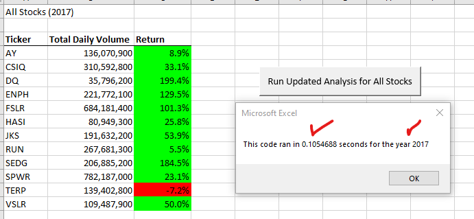
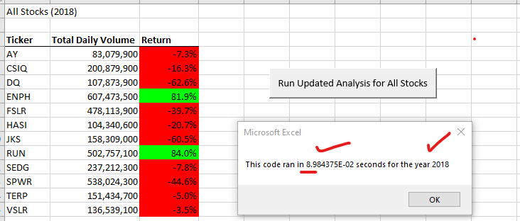
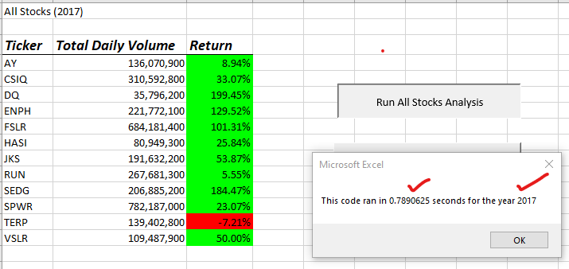
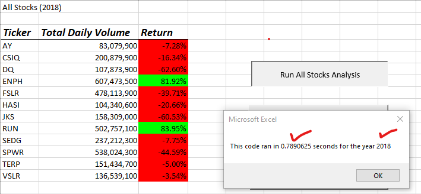

# VBA Challenge

## Overview of Project
Using the concept of 'refactoring' code in order to understand if there are better or faster methods of running the code that was written during the module section. If we 
can refactor the code to run more efficiently, Steve could provide more stocks in his analysis for his parents as well as adding additional years of the stocks yearly return.  
Adding additional years of data could prove just as valuable as adding additional stocks. Therefore, refactoring the code would provide a means of building on
what we had already created by looping through all the data once rather than several loops.

### Purpose
During the first phase of the project, we created a module that provided Steve's parents with some great statistics on 12 different stocks.  For this phase,
we wanted to see if that if we changed how we used arrays, for loops as well as nested loops, it would result in providing faster output.  If we are able to speed up the 
amount of time it takes to run stocks through the modules for different years and additional stocks (many more than 12), Steve's parents will have more data in their hands in a 
quicker amount of time.

## Over all Results
### Analysis of stock performance between 2017 and 2018 regardless of the method used to calculate.
It appears that for 2017 there was an overall trend of an increase in Yearly Return over 2018. 2017's increases were sometimes quite dramatic in being over %100 increase for 
nearly 25% of the stocks tracked.  For 2018 while the decline of Yearly Return was more modest than the in increase in 2017, nevertheless there was an overall decline on nearly all 
the stocks, it would be interesting to see bar graphs for all the months in the year to track why the dramatck ups and downs over two years. It would also be interesting to see
what types of stocks these are which may help answer why one year they generally increased (2017) and the next the generally decreased (2018).

### Analysis of refactoring the code
Refactoring of the code did not have a much of a beneficial outcome, in fact, on the second iteration the module slowed down from the previous results of running in under 1 second, to now
taking more then 8 seconds (8.98) or even more than 9 (9.76).

## Summary
### The advantages of refactoring code is that it is an important part of the coding process. One should not be adding new functionality, rather one should aim to increase the efficiency 
in the code by taking fewer steps, using less memory, or simply improving the logic. Sometimes a second look at a process illicets a better and cleaner way of running code.

### In general, there should be no disadvantages when it comes to refactoring code as by definition it should result in an improvement. If the refactoring results are not satisfactory in that
they are not faster or more effiecient, then further refactoring would need to be completed to order fix the introduced issue.

### When refactoring the original VBA script, we did have a module to start with that we realized would quickly become inefficient as eventually Steve wanted to add additional stocks and
that at some point, it will not be possible to input new stock tickers or it would become so incredibly time restrictive, that adding manually is not feasable. Since our results were mixed
in that the running of the second or subsequent years through the new module are much slower, more coding would need to be executed to address or determine the issue.

	

